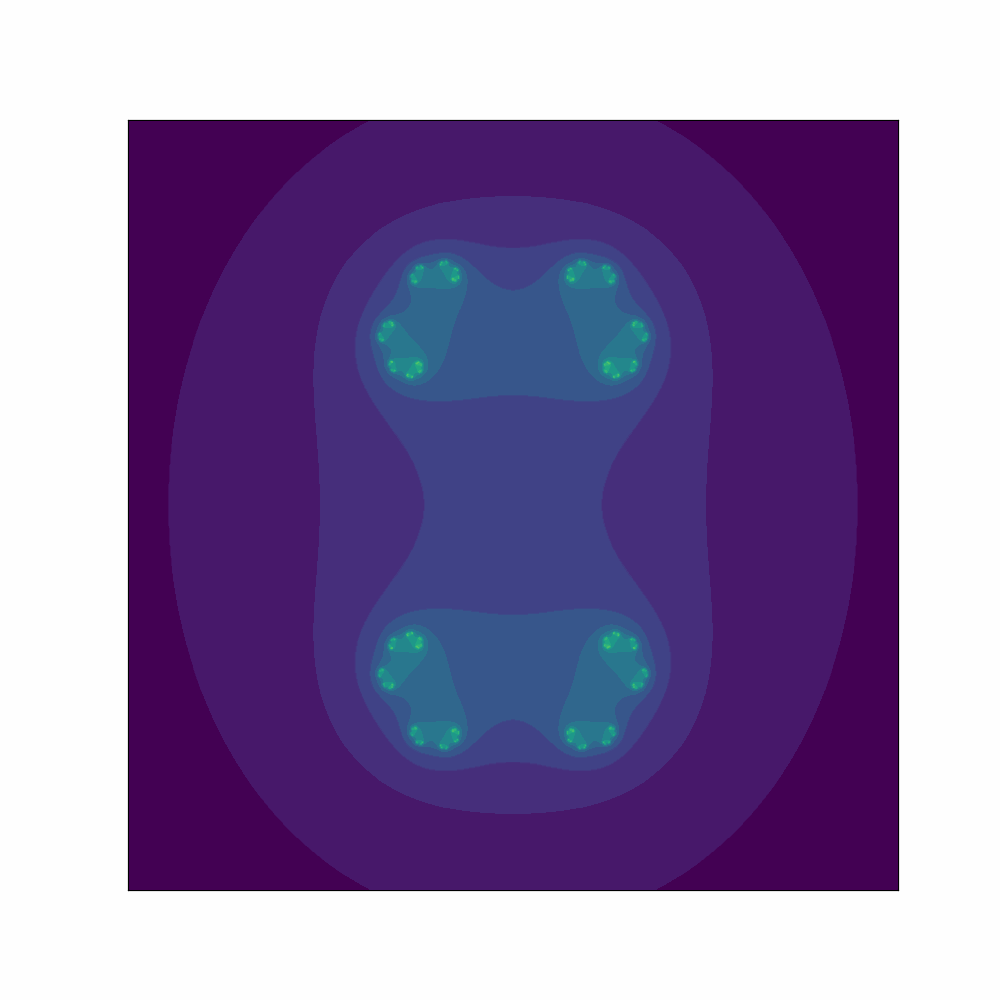

# Escape-Time Fractal Animations
## What are Escape-Time Fractals?
First and foremost, fractals are geometric shapes which display a unique property known as self-similarity. This means that they have the same pattern(s) embedded within themselves at different scales, which remains true at arbitrarily small scales.

While many distinct types of fractals exist, this project only focuses on animating the subset known as escape-time (or orbit) fractals. These fractals can be generated by iterating through a formula on each point within a given space. If a point begins to diverge as the formula iterates, it *escapes*; otherwise, it remains bounded. Four of the most well-known escape-time fractals are the Mandelbrot set, Julia set, Burning Ship fractal, and the Newton fractal. 

## The Mandelbrot Set
The Mandelbrot set is the set of complex numbers c for which the function fc(z) = z2 + c does not diverge to infinity when iterated from z0 = 0. It’s formal definition is credited to Adrien Douady who named it in memory of Benoit Mandelbrot, a pioneer of fractal geometry.

## The Julia Set
The Julia set, defined by the function fc(z) = z2 + c, consists of values such that an arbitrarily small perturbation can cause chaotic, changes in the sequence of iterated function values. For a fixed parameter c, the Julia set is found by iterating the function on each point z. The set was named after French mathematician Gaston Julia during the early 20th century.

## The Burning Ship Fractal
The Burning Ship Fractal is a variant of the Mandelbrot set, first defined by Michael Michelitsch and Otto E. Rossler. This fractal can be generated by iterating the function zn+1 = (|Real(zn)| + i|Imaginary(zn)|)2 + c, z0 = 0 in the complex plane c, which will either escape or remain bounded. The difference between it and the Mandelbrot set is that we take the absolute values of both the real and imaginary components before squaring at each iteration.

## The Newton Fractal
A generalization of Newton's iteration can be defined by zn+1 = zn - a(f(zn) / f'(zn)) where the special choice a = 1 corresponds to the Newton Fractal. This fractal differs from the previous ones in the sense that it applies Newton’s method to a fixed function then checks whether a point converges to a root. 

### Output for f(z) = z3 - 1

### Output for f(z) = z5 + z3 + z - 1

### Output for f(z) = z9 + z6 + z3 - 1

## References
1. [Wikipedia - Fractals](https://en.wikipedia.org/wiki/Fractal)
2. [Maplesoft - Escape Time Fracatals](https://www.maplesoft.com/support/help/maple/view.aspx?path=MathApps/EscapeTimeFractals)
3. [Matplotlib - Animate Your Own Fractals in Python with Matplotlib](https://matplotlib.org/matplotblog/posts/animated-fractals/)
4. [Wikipedia - Mandelbrot Set](https://en.wikipedia.org/wiki/Mandelbrot_set)
5. [Complex Analysis - The Mandelbrot Set](https://complex-analysis.com/content/mandelbrot_set.html)
6. [Wikipedia - Julia Set](https://en.wikipedia.org/wiki/Julia_set)
7. [Wikipedia - Burning Ship Fractal](https://en.wikipedia.org/wiki/Burning_Ship_fractal)
8. [Wikipedia - Newton Fractal](https://en.wikipedia.org/wiki/Newton_fractal)
9. [Learning Scientific Programming with Python - The Newton Fractal](https://scipython.com/book2/chapter-8-scipy/examples/the-newton-fractal/)